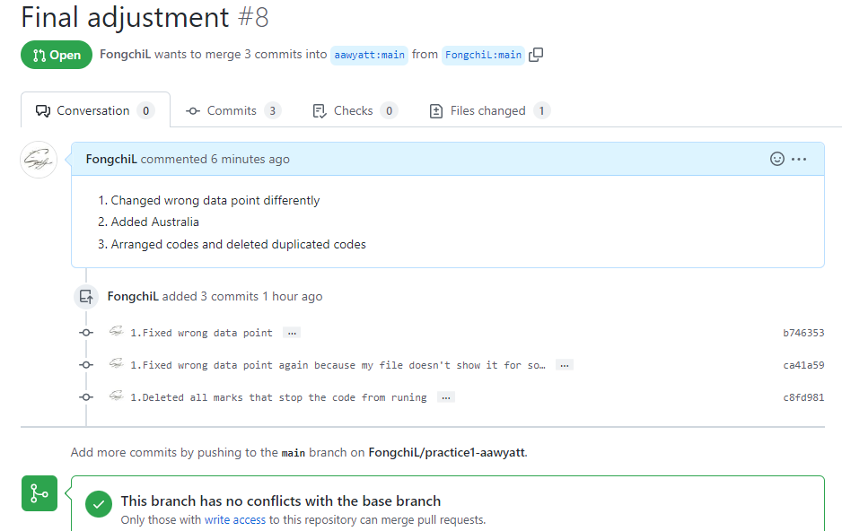
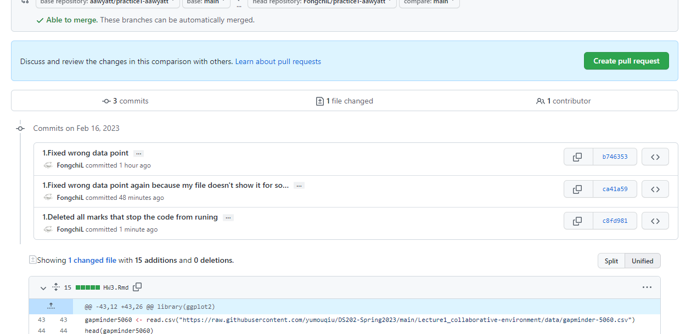
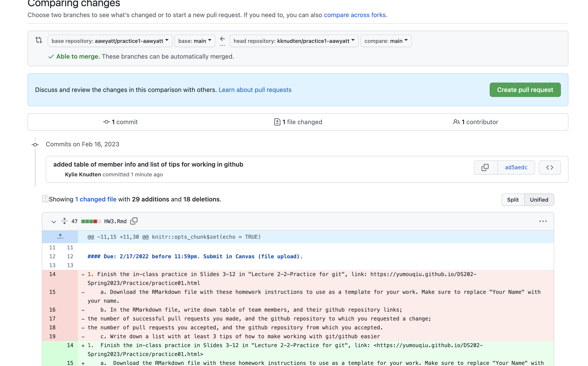

```{r setup, include=FALSE}
knitr::opts_chunk$set(echo = TRUE)
```

#### Due: 2/17/2022 before 11:59pm. Submit in Canvas (file upload).

1.  Finish the in-class practice in Slides 3-12 in "Lecture 2-2-Practice for git", link: <https://yumouqiu.github.io/DS202-Spring2023/Practice/practice01.html>

    a.  Download the RMarkdown file with these homework instructions to use as a template for your work. Make sure to replace "Your Name" with your name.\

    b.  In the RMarkdown file, write down table of team members, and their github repository links;\
        the number of successful pull requests you made, and the github repository to which you requested a change;\
        the number of pull requests you accepted, and the github repository from which you accepted.

        | Names:                                             | Kylie Knudten                                    | Alison Wyatt                                     | Angelina Allen                                     | Fangqi Li                                        |
        |---------------|---------------|---------------|---------------|---------------|
        | Github Repository Links:                           | <https://github.com/kknudten/practice1-kknudten> | <https://github.com/aawyatt/practice1-aawyatt>   | <https://github.com/ajallen23/practice1-ajallen23> | <https://github.com/FongchiL/practice1-FongchiL> |
        | Number of successful pull requests:                | 3                                                | 1                                                | 2                                                  | 1                                                |
        | Github repository to which you requested a change: | <https://github.com/aawyatt/practice1-aawyatt>   | <https://github.com/kknudten/practice1-kknudten> | <https://github.com/aawyatt/practice1-aawyatt>     | <https://github.com/aawyatt/practice1-aawyatt>   |
        | Number of pull requests accepted:                  | 1                                                | 3                                                | 1                                                  | 1                                                |
        | Github repository that you accepted a change from: | <https://github.com/aawyatt/practice1-aawyatt>   | <https://github.com/kknudten/practice1-kknudten> | <https://github.com/aawyatt/practice1-aawyatt>     | <https://github.com/aawyatt/practice1-aawyatt>   |

    c.  Write down a list with at least 3 tips of how to make working with git/github easier

        1.  Steps to following each other on github - helps us to have quicker access to teammates' repositories.

        2.  Have notifications on for receiving pull requests in order for timely merging and updating repositories.

        3.  Make comments when opening a pull requests so the person receiving it can know exactly what was changed.

2.  Generate the graph of LifExp vs. gdpPercap for US, Canada (fixed data) and Australia by RMarkdown based on the data set "gapminder-5060", like what we did in the class.\
    Please use Github to collaborate on this problem. For example, one member can create the plot of US in his/her repository. The other member will fork this repository, add the result for the second country, and make a pull request for merging into the main repository. Each member should at least analyze one country and make at least one pull request. **Please submit the RMarkdown file, the output file, and the screen shot of the successful pull request and the merge.**

```{r}
library(ggplot2)
gapminder5060 <- read.csv("https://raw.githubusercontent.com/yumouqiu/DS202-Spring2023/main/Lecture1_collaborative-environment/data/gapminder-5060.csv")
head(gapminder5060)

#fix wrong data point of Canada
gapminder5060 [82,4] <- 69.96

UnitedStates <- gapminder5060[gapminder5060$country == "United States", ]
head(UnitedStates)

Canada <- gapminder5060[gapminder5060$country == "Canada", ]
head(Canada)

Australia <- gapminder5060[gapminder5060$country == "Australia", ]
head(Australia)

countries = c("United States", "Canada", "Australia")
UnitedStates.Canada.Australia = gapminder5060[gapminder5060$country %in% countries, ]

ggplot(data = UnitedStates, aes(x = lifeExp, y = gdpPercap)) + geom_line() 

ggplot(data = Canada, aes(x = lifeExp, y = gdpPercap)) + geom_line() 

ggplot(data = Australia, aes(x = lifeExp, y = gdpPercap)) + geom_line() 
UnitedStates.Canada.Australia = rbind(UnitedStates,Canada,Australia)

ggplot(data = UnitedStates.Canada.Australia, aes(x = lifeExp, y = gdpPercap)) + geom_line(aes(color = country)) 

```

Screenshot 1

{width="560"}

Screenshot 2

{width="560"}

Screenshot 3

{width="560"}

3.  Write a paragraph (\~200 words) describing an example of what you consider data science. Write your paragraph in R Markdown. Include at least
    a.  one link to a chart or an image and
    b.  at least one itemized or enumerated list.

I believe that data science is a powerful tool to analyze and understand complex systems. One interesting example of data science is climate modeling. By analyzing large datasets of historical weather patterns, researchers can build complex mathematical models that simulate future weather conditions. These models take into account factors such as temperature, atmospheric pressure, wind patterns, and ocean currents, to predict how the climate will change over time. The output of these models is often presented as a visualization, such as a chart or map, that shows how different regions will be affected by rising temperatures, sea level rise, and other climate-related phenomena. An example of such a visualization can be found at <https://coast.noaa.gov/slr/#/layer/slr/2/-9660356.684045017/4946118.648082482/4/satellite/none/0.8/2050/interHigh/midAccretion>. Overall, data science plays a crucial role in understanding and addressing the challenges posed by climate change.

Without specific cases, some benefits of data science include:

-   Improved decision making based on data-driven insights

-   Faster and more accurate predictions for complex systems

-   Identification of patterns and relationships that may not be apparent through other methods.
